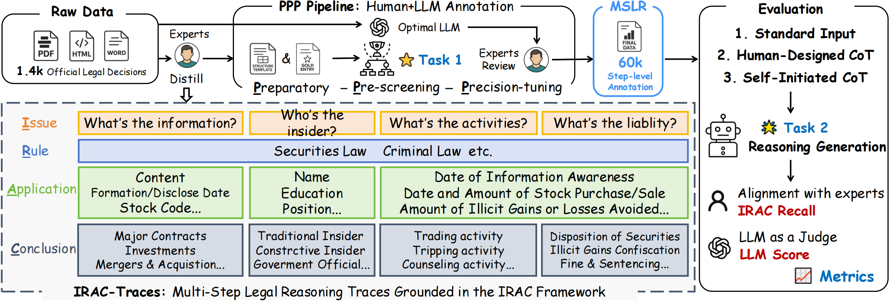

# MSLR: Multi-Step-Reasoning-Trace Chinese Multi-Step Legal Reasoning Benchmark Dataset
[en](README.md) | [zh](README_zh.md)

[![OpenReview](https://img.shields.io/badge/View%20on%20OpenReview-8C1B13?labelColor=gray&logo=data:image/png;base64,iVBORw0KGgoAAAANSUhEUgAAAB8AAAAgCAYAAADqgqNBAAAACXBIWXMAABMYAAATGAHPrZVxAAAAGXRFWHRTb2Z0d2FyZQB3d3cuaW5rc2NhcGUub3Jnm+48GgAABkJJREFUSIm9121wVNUZB/D//5y7uyHhxS4CClpBgRmcsTaDRWYKrRQTjJOiTgvm1XasCJtkNwWJo3RGWew4lryS3U1Cp2gFNmJwaG0hQxJoUjpOobVSK5YWSrFQB2RTUCQmu3vPefrBQlGZ0BTi8+m+zfObc85z7z0PRQRDiUfuqfdnqgHd2P5kIpBb8wAELRTkON70iXTa8wdSSps6q369LLd6Wktn1eHBcqkhyQC8xryaSnsOBfKemwyL8QDGi8K3jetkA7jRCvMCOXXZFB5auqDmzsFyOZfDls9ruGbASb8iwvaWXSvrBPIPgnPgOo8PmL4VPidrCok2a1WOAN2g3aCIAWuRdAxtIKdmNcgPmzsfq/10bl5u2pfOr75FKR4GAMKZ6nh0b9pNLYHgVhC9Yu0bSnGyABMhOOCK5xcf+Cf2jj77zzE/2bn8dFlOdbOQpNd90rFZprE9eHZQfOnCcKbqzzoIIOHQLkxb9R0q5NPr5jdtf+JM6N6IL+2m1hjLDZq2FcBMqzhDWdkNwRoBtSK+NsE9V/KeM+aLgLvQCqcS9ljzrqq1g+KLF4e9Y9/POgLBDUK+DStLNO37Aj2XYg4nHc+bHmNOQvCMFWml4joq1Om0ea8/xWOOj+OVUlMFkkHgWwTeorAnZcwJx3HGNXet2A9couAC89fO8p/JytOGcwRSpUSe1UpGCVS+QGotVYfjujmgzIPo59fvrjqixdYqY8U4qt6T6czSGg9S5ETS7etwxVMF4jpDu8rRDAC2hwQvOfJlOTV/JTCdImuadlU9/Yl7d9eWgXIfgVcATCQwG5aN0DJXhAmAPUqh1xB+r/IcPb++5fOaRibGjetva1tkAvPrJ4FusRb18oVqD4e3ev2n0vkkfwiRCMhMAAjk1GUrESe267Hfi8avlFW/tUj/i9DZIkhBibelc+WqT03g8YtPYt1l584fN+9e/m55bnWnodxyYeTrKuL1gN1SGS3d94llyKnpATDHVZjmWE5Xlh9aJaMAqWnuWnnbZwrmf4xg7tqJFBGEw2E1tvfmmyoipUcDOTV7AGQq2NJY1+MHy+dVX2cc3nn9nL5fnnwtKy4iZ1u6qpb+v+jF4QCA/9S0Qkv5KQAPSB9EZgpVKYBVse6qkwBeBYBld9c+D3LU1YCBiwouUh7Phajk4Xd697ruwOxz5OsbO1b2XS3oknhDRXwBRV7SMLMN9H6vsVOWNZeeGk70fCiP9bxmLe9wReUqqpmfFwwAKo1UoVLSBdF7rJg9DYEtkz83nMRCEamvbCr8kyO+m7/fXPBOY8XmxQ3lm2YMN64fnlzQ1jfaDOz83c8Svo/G7Ni7461xCuq0Q/vnWffe3j+cuDoxPvVzsfzj6MT0GUJWJweSPw7GirYZ6hcjoc1zhxUHsRdg4fJo4dvW49mTkeHbtq48vkSs7ARUcl2w9XvDhVNEEA3Gv2rBBcbajZp8yois0QpzIbQgRkDbdiedcbostujc5VMOAW+obJ1A1x4FMALAPgH2EbgDQHYoWpwJAJGK+DEInwJsUsPtLot99+RVwVevbvP6E8lKKOwNNpb8JhKK+MT4twuQHuH23WfViC8kNR+BsIvEyyJ40Pq8RxzX3BRsLNh/RfiFz2toS7aI2QHBNipuFGu/JGQeRW5XlAIDPbYyUtQRDm/1+hOpDguOrIwWfeVK8Av/czHmURDXA/J3SduPoNS1CvyLgFsNMIUiqxvL45v84HEq+4zPxYErgYGLtlEu9LMQfiMULamD5hOgFAajRT8IRYu2EHIXgFuhcCwYK4oL1aGUZslVw1fECo6HYkXdH7/bLAY46b8P2RcA9J65dlIbAFgj9wOsrS/fPPVK8M80DRSdAOwbAvlRONzjXJN492lSHVTEQ2N7j38ZwOvw6K10JeuGhPcoADSWtc7MMJ6/Pbp+0QdDwQdtGiIV8YcF2ABgn8cyL01ppz59V7AxmDz/TDQYv80K3gSkNRQtGdJSDNouCWAAGFDWJ7V8XQlnW+tf1VzW2pBW0gqwlUofgBgCH284hxKDNoqhaPGLxusdFYqUvKCEs/5zeUJaIR/APRB5KNhYsF+AbyrqiqHil28U6xb1A4AVu0lB3ShWP0ekR0KrXhIvAUBltHj7UGEA+DfT0uk46cX1OAAAAABJRU5ErkJggg==)](https://openreview.net/forum?id=htj5HOOjql)  [](https://arxiv.org/abs/2511.07979)  [![Hugging Face](https://img.shields.io/badge/View%20on%20Hugging%20Face-blue?labelColor=gray&logo=data:image/png;base64,iVBORw0KGgoAAAANSUhEUgAAACAAAAAgCAYAAABzenr0AAAAIGNIUk0AAHomAACAhAAA+gAAAIDoAAB1MAAA6mAAADqYAAAXcJy6UTwAAAAGYktHRAD/AP8A/6C9p5MAAAAJcEhZcwAALEsAACxLAaU9lqkAAAAHdElNRQfoBRILLggNuk3UAAAKNklEQVRYw42WeXCU9RnHP7/32CO7m2M3gYVwQwMptAqWVDwwrSLToaVVi7UFWg+mM5UZtdoZay1Oq70tM+rYc3RqhxioFlBRZERGSZSjtiEakgqSAwo5dpNNdrPnu+/7/vrHbxNQccbfzM6+8zue4/s8z/d5BJ+wHn/8cRKJBLNmzeKOO+7gxIkT1NXVTZ4fPHzMF41O87iOI3u6TxbWrP6SNXHW2NjI+Pg4d999N/F4nDVr1lBfX8+nXk8//TRSSlavXo2UEiklmBUiMW7PKzhyve24jzlW+iUnP/qmkx97wynmdxZd+ZucLb8xNJyaNvFGSsn9998PwIEDBy6qS3x0Y/v27SxdupSFCxdO7o1l7IVBn36Hnum+UcSOzCH+L53xHiimQOjgq4GqxTDlSktGlr1ve8LNiZHRbVNrqvoBhBBIKdm/fz/XX3/9J3u+c+dOOjo6Jq1v/sdOM1+UG9xU7/uy7edS/nORlE0eKZ83pNzjl/LVoJR7A1K+4JVyuy5lU1DKvddK2fOcdKzM4UzeWQUIKeWkjj179lwcgVOnThGJRKisrATgzbeO+q68fPl95tCBB2h7KEDqHagJQFUAvAYIcf61BBwXshbEUzCuwdwNyEt+OmR5Z96/YvmSbW3tx91FixYhpeTIkSOEw2EA9AkDYrEYe/bsYd26dTzyq98b3/nWN39ont31Mw7f6Ufrhrk1EC4DU79Y5EAT4DOgMgA+4MwhxHBXUI+uWHnrDx48bejieDKZpKGhgcHBQXbt2nUegebmZpLJJOvXrycUCpErcqM/9vrfeOv2coIJmBEGXShPP80SQLYIPTGo/hryyr/0pZzymyuCvncAWltbiUaj1NXVKQMGBgaYM2cO+XyegZHszKg59IJo2bAMu015rolPqfkjRmQsODUM9T/BuWTLC8faj3/3C5ddOr5p0yZCoRCPPfYYemdnJ/v27WP37t0IIfCa2p3GiSc30r8d5laDRz8vUCv9XwyJibMLzz26CvKZdrToyjmVsy97z9RF19q1a4nFYpimidbZ2UlLSwuaptE3mJlmpE/eQk+zSjifoYQJiCV0/v5KOfsOBSjaH0ek4wMvf9ldyXsnvec3JRAOgpGAU9t8Xs3e8Mqrr5UBdHZ2cu+996IFg0F27NgBQE048EVt6GA9Vi9UBZUAKUHCs6+Vs3V7mIefiXDspFd5XEJmLK3x22fDPP5cJb9rDjM6rivtEtA1qA5C/z60TN+KL664ug7g5ZdfJhqNovX29iKlRAiBR2avYPAtDwFNwVd0YHAUkhnSOY2qkEPdTAvb+TACtiOoqXSYX1skmxfYtoSRFMTHwHUh5IdiPyLRXhMI+C8D6Orq4u2338Z49913AWh68ZBfs0Y+S+p9CPpUnTsOZAugC265LsXVl+RYviiPx5Tgnoc5Uu7wy+/HOT1kEh/TqS63od9Syl0XTANMBxIdwpi1bokQQkgp5RNPPIE2NDQEQP2iujJhjUYpDIPXVJK9JkyPQLicz8ws0nhZlkDAxTQ+nIVCQJlfUj+vwMqlOYSuwZRKiIZB11VienXInEHIYu0PNt9lCiHo6+tDy2azAJT5fR7h5Py4BRW3Ccl+DxiqElLjGr1nTVx5QdZr6jea0uk760E6Jau8ZsmR0j1dg+I4QtrBJUs+pwPE43EMTVPKXNeVEk0KIUC6H683Af897eGRZyJc/fkcqxoyzKixyRY02k542X0wxKxokUc2DSM+ViSlDaEhEe6E047jYPh8PgBi8eH8ovmBFHoZWKOQLyqrDW3yfU2lQ74gaN5fzkuHAlSFXPKWYDSlYxUFy+vzaMYFdkvAclQlFR2oCCOFkdje3GTfcMMNhMNhjJ6eHoQQ/GjL1vxVP/5eXCubAed6wRWK96dXgO1CwWZWZYAVn8uzrzVIY05jNKsRAXqB/kqHxmVZSBdgJAchb6mKUqVmZcP8hbgY8bb/vOOMjY4gpcRoaWmhqqpKPPzA5m/q2f+uwHUg50JtBRRs6BlRVKwJjJzFbV/xUhczWHfCS8YVBITkXNDl5NeSLKnNwKmEUjicVihMCULBgREHcoN48mdvSmfzBwN+70tQ6tVDY9bsKbJ7n2jdsIhku/K4thJqgnAyBn5TfXcPw9wwuCFo80O/CX4XFudhYQGGkjCShXkR6B1R72aFoW8ERnMqnDNuxL3ir++ciRe+OmfG1JgB4PV6Zot490zGu2BeNeRtiKeVgOkVkMiq76AXhtKwwAerbMUFE/yfs2E4A5GAyh1Th2g5xMclliNYUA1FG+KHEfnYvEBg5nQgpikYnABC6DiaUlzug9lVCkah4CeehqkhNXTE0hKnlGQuUJTQn1L3qsqgPykJeiFTkGSLgrkRMDRJPC3BAKQBbtlED8Nv0sDAGz48BfCZcHZMoRAth1xRxdFrKASi5TCQEiTzcnIuiaUhmVNh8+gQ8goqfFB0BdFyGM1KBscFFWWCYj8i/q+KUDCwDJQ5SISB7gNXKu/DZTCSUTQ6Jag8C3iUx1OCqs/HxqHcC0VXITU1BBWqpKkOqLteAwZSEkMXzKyETKHUoHxIiXneAElmkjPSBWVI0KviPjGMTNS2pkGlH/qTAqdU366ECv957pq8KyASEGpWLIWzREyulFkQE01V2Hgj6mGZqRQ4bmn+u8gq2OcNm5Bp2XxsVtSEynyJSk5TgDDBUwFSFidzIDGaeEPOveUMs26FvjQMJJQs21UsdqGi8byafHMWfDAIfXFl0GBSseeFdx2pHJEOnI7DkAZLHsCdcsX7g/3/OwQgNm7cKLZt26YPJ1JrqwL8Qhs4UE93E8TeBmcYvEIlliYU3BkXpq6GaCNYKdAMMAPQswPG2yBoqjJ0XEVARQ08tTB9FSzYiBNpODacSD0QnVrz+j333OOKzs5Obr/9dnH06FGt/b3OBQs+U/dtn2Z9Q09/sJDh//hIvAeZ/4GTB281TFuJnLm2P69X75DSzSJxhaZV+XLd3xZndlcz/G8opsEMQmgeRJYiI8tybtns4zlL7jre8e5zKy5vOL127Vq3qalJ8uijj9La2sr69esnKMXY//obM4aGk1/P5J1fW0X7RdvKHbELmbaiVTiYKzhP9J05dxXgQY2c+ozaWt+5weHr8pbz56KVb7ULmWO2lT9cKDq70jn7kf6hkTUvvrRnWinptU2bNokjR46wdetWjK6uLkzTpKmpSS5fvpz9+/c7q677Uj9wDnjl1ttu8zY2ftkfDIb0s2fPWPfcfVcasC+99FJRX18vpZS0t7dbtdHqA0JoLX/445+CU6ZO9STHRu19r76ae/755/IluhI333yzvOaaa+TmzZtpaGggFoshEokETz31FLNnz6a1tZUnn3ySo0ePsnfvXtHR0cGxY8dEb2/vZGJfe+21cuXKlfKhhx6ivr4ey7Lo7u5my5YtoqWlhZaWlslSmD9/PsuWLZOLFy+WDz74IKZpct9993HTTTdx7tw5PB4P/wdyObJGug0H9QAAACV0RVh0ZGF0ZTpjcmVhdGUAMjAyNC0wNS0xOFQxMTozMzozNCswMDowMNKO6kUAAAAldEVYdGRhdGU6bW9kaWZ5ADIwMjQtMDUtMThUMTE6MzI6MTArMDA6MDD6exqpAAAAKHRFWHRkYXRlOnRpbWVzdGFtcAAyMDI0LTA1LTE4VDExOjQ2OjA4KzAwOjAwcvvAdgAAAABJRU5ErkJggg==)](https://huggingface.co/datasets/Yuwh07/MSLR-Bench)  [![ModelScope](https://img.shields.io/badge/ModelScope-black?logo=data:image/svg+xml;base64,PHN2ZyB3aWR0aD0iMjIzIiBoZWlnaHQ9IjIwMCIgeG1sbnM9Imh0dHA6Ly93d3cudzMub3JnLzIwMDAvc3ZnIj4KCiA8Zz4KICA8dGl0bGU+TGF5ZXIgMTwvdGl0bGU+CiAgPHBhdGggaWQ9InN2Z18xNCIgZmlsbD0iIzYyNGFmZiIgZD0ibTAsODkuODRsMjUuNjUsMGwwLDI1LjY0OTk5bC0yNS42NSwwbDAsLTI1LjY0OTk5eiIvPgogIDxwYXRoIGlkPSJzdmdfMTUiIGZpbGw9IiM2MjRhZmYiIGQ9Im05OS4xNCwxMTUuNDlsMjUuNjUsMGwwLDI1LjY1bC0yNS42NSwwbDAsLTI1LjY1eiIvPgogIDxwYXRoIGlkPSJzdmdfMTYiIGZpbGw9IiM2MjRhZmYiIGQ9Im0xNzYuMDksMTQxLjE0bC0yNS42NDk5OSwwbDAsMjIuMTlsNDcuODQsMGwwLC00Ny44NGwtMjIuMTksMGwwLDI1LjY1eiIvPgogIDxwYXRoIGlkPSJzdmdfMTciIGZpbGw9IiMzNmNmZDEiIGQ9Im0xMjQuNzksODkuODRsMjUuNjUsMGwwLDI1LjY0OTk5bC0yNS42NSwwbDAsLTI1LjY0OTk5eiIvPgogIDxwYXRoIGlkPSJzdmdfMTgiIGZpbGw9IiMzNmNmZDEiIGQ9Im0wLDY0LjE5bDI1LjY1LDBsMCwyNS42NWwtMjUuNjUsMGwwLC0yNS42NXoiLz4KICA8cGF0aCBpZD0ic3ZnXzE5IiBmaWxsPSIjNjI0YWZmIiBkPSJtMTk4LjI4LDg5Ljg0bDI1LjY0OTk5LDBsMCwyNS42NDk5OWwtMjUuNjQ5OTksMGwwLC0yNS42NDk5OXoiLz4KICA8cGF0aCBpZD0ic3ZnXzIwIiBmaWxsPSIjMzZjZmQxIiBkPSJtMTk4LjI4LDY0LjE5bDI1LjY0OTk5LDBsMCwyNS42NWwtMjUuNjQ5OTksMGwwLC0yNS42NXoiLz4KICA8cGF0aCBpZD0ic3ZnXzIxIiBmaWxsPSIjNjI0YWZmIiBkPSJtMTUwLjQ0LDQybDAsMjIuMTlsMjUuNjQ5OTksMGwwLDI1LjY1bDIyLjE5LDBsMCwtNDcuODRsLTQ3Ljg0LDB6Ii8+CiAgPHBhdGggaWQ9InN2Z18yMiIgZmlsbD0iIzM2Y2ZkMSIgZD0ibTczLjQ5LDg5Ljg0bDI1LjY1LDBsMCwyNS42NDk5OWwtMjUuNjUsMGwwLC0yNS42NDk5OXoiLz4KICA8cGF0aCBpZD0ic3ZnXzIzIiBmaWxsPSIjNjI0YWZmIiBkPSJtNDcuODQsNjQuMTlsMjUuNjUsMGwwLC0yMi4xOWwtNDcuODQsMGwwLDQ3Ljg0bDIyLjE5LDBsMCwtMjUuNjV6Ii8+CiAgPHBhdGggaWQ9InN2Z18yNCIgZmlsbD0iIzYyNGFmZiIgZD0ibTQ3Ljg0LDExNS40OWwtMjIuMTksMGwwLDQ3Ljg0bDQ3Ljg0LDBsMCwtMjIuMTlsLTI1LjY1LDBsMCwtMjUuNjV6Ii8+CiA8L2c+Cjwvc3ZnPg==&labelColor=white)](https://modelscope.cn/datasets/yuwenhan/MSLR-Bench)


With the rapid development of large language models (LLMs) in legal applications, systematically evaluating their **reasoning ability in judgment prediction** has become increasingly urgent. Currently, publicly available legal evaluation benchmarks lack a unified evaluation framework and do not adequately support these two tasks. To fill this gap, we propose **MSLR**, addressing a critical gap in structured reasoning evaluation in the field of Chinese legal natural language processing, and providing a solid foundation for the evaluation and optimization of legal vertical domain large model systems. For more details, please refer to our paper.

## 📄 Introduction
MSLR is carefully designed to precisely evaluate large models' **legal document understanding and case analysis reasoning abilities**. We designed a semi-automated dataset construction scheme, building a comprehensive insider trading dataset through a **human + LLM** approach, which can also easily scale the dataset size and case types. On this basis, we designed two tasks: **structured information extraction** and **case fact analysis and judgment prediction**. To better evaluate model performance on these two tasks, we designed detailed and diverse evaluation methods, with **precise and comprehensive** results. Meanwhile, we created a **human-experience-based CoT (Chain-of-Thought) reasoning chain** designed by legal experts, aiming to test whether the model's reasoning ability improves when provided with reasoning chains, and whether it aligns more closely with human judicial processes.

## 📖 Data Sources and Construction Process

### Data Sources
The MSLR data mainly comes from the following three public channels, focusing on **insider trading cases** from 2005 to 2024, covering administrative cases, criminal cases, and non-prosecution cases:

- Administrative penalty decisions issued by the China Securities Regulatory Commission (CSRC);
- Criminal judgment documents published on the China Judgments Online;
- Non-prosecution decisions publicly disclosed by national procuratorates.

Each original legal document was collected in `.docx`, `.pdf`, or `.html` format, then converted into structured text for unified processing, while recording key information such as **document number, judgment date, and source link**. We removed some publicly available documents without specific case descriptions and outcomes, retaining only valid documents.

### Structured Data Design
In collaboration with legal experts, we developed a unified structured field system, detailed in `data/schema.json`, covering six major dimensions: insider information identification, basic party information, trading behavior, illegal gains calculation, applicable legal provisions, and final penalty results. All fields strictly align with the "Securities Law of the People's Republic of China," "Criminal Law of the People's Republic of China," "Civil Code," and other relevant statutes, ensuring **legal consistency, semantic comparability**, and structured support for judicial reasoning.

### Data Annotation Process
#### Manual Annotation
In the first phase, we manually annotated over **1000 real case documents** item by item, labeling more than **50,000 fields** according to the structured template. All annotations were completed by professionals with legal backgrounds, with **cross-review and sampling quality control mechanisms** in place to ensure consistency and accuracy of legal interpretation.
#### LLM-Assisted Extraction + Manual Verification
After initially establishing a high-quality seed set, we expansively processed over **400 additional case documents (2020–2024)**. After experimental comparison of different large model extraction strategies, we finally selected DeepSeek-V3, which offers a good balance of performance and cost-effectiveness, as the automatic extraction tool. To enhance its adaptability to legal tasks, we optimized the extraction prompt templates. All automatic outputs were manually verified by legal experts on a field-by-field basis to ensure structural completeness and semantic accuracy.



### Data Statistics Overview

| Metric                     | Value   |
|----------------------------|---------|
| Time Span                  | 2005–2024 |
| Total Number of Cases      | 1389    |
| Average Number of Fields per Document | 43.03   |
| Total Structured Field Entries | 59,771  |
| Average Core Field Completion Rate | 86.58%  |
| Average Number of Characters per Document | 2515.99 |

### Data Format
All raw and structured data are stored in the `data` folder. Processed data are saved in JSON file format, located in `data/processed`, which can be loaded using `json.load`. The `input.json` file summarizes the input parts from each JSON file for convenient usage.

## 🧩 Benchmark Task Definitions

### Task 1: LLM Automatic Annotation

This task aims to extract standardized key fields from legal case paragraphs, simulating the element summarization process performed by legal professionals after reading documents. Fields include insider information identification, party information, trading behavior, illegal gains, applicable legal provisions, and penalty results. Specific field definitions can be found in `data/extract_schema.json`.

- Input: Case description paragraph from the original legal document (natural language text)
- Output: Structured JSON format, filling in various field information
- Evaluation Metrics:
  - Field Accuracy: Strict matching accuracy of field values
  - Semantic Accuracy: Matching rate based on semantic similarity of fields
  - Overall Accuracy: Weighted composite score of the above two
  - Field Completeness Rate (FCR): Coverage and format completeness of output fields

### Task 2: Chinese Multi-step Legal Reasoning under the IRAC Framework
This task focuses on whether the model can generate logically rigorous and structurally complete legal analysis processes and final judgments based on case descriptions, evaluating reasoning quality and coverage of legal elements.

- Input Modes:
  - Standard Input (Std): Provide only case description, allowing the model to autonomously complete analysis and judgment
  - Chain-of-Thought Input (CoT): Provide case description + structured reasoning prompts, guiding the model to reason in the order of "Fact Identification → Legal Application → Judgment Result"
- Output Form: Natural language complete analysis process, covering core facts, applicable legal provisions, and judgment conclusions
- Evaluation Metrics:
  - LLM Score: Scores assigned by high-performance large language models based on logic, completeness, and legality (graded: A/B/C)
  - IRAC Recall: Measures consistency between model output and manually annotated structured fields (field-level matching)

#### CoT Reasoning Template Construction
Professional legal practitioners designed a Chain-of-Thought (CoT) prompt template based on human experience to guide the model in stepwise reasoning similar to judicial practice in insider trading cases. During design, full reference was made to the "Criminal Law of the People's Republic of China," "Civil Code," "Securities Law," and other relevant statutes, ensuring **rigor and authority** in legal application and expression. Furthermore, legal practitioners with years of trial experience participated in template construction, abstracting the common reasoning paths judicial authorities follow when handling insider trading cases based on **real adjudication logic**.
```text
Insider Information Formation → Information Awareness → Trading Behavior → Illegal Gains → Legal Application → Penalty Decision
```

## 📊 Experimental Design
In the experiments, we evaluated the performance of three major categories of models on the two tasks. Additionally, we provide example outputs from different models in the `example/` directory, visually demonstrating differences and capability boundaries of various models in real legal text processing.

### Experimental Models
- **General-purpose LLMs:** such as GPT-4, Qwen2.5, GLM4, DeepSeek-V3, etc., with comprehensive text understanding and generation capabilities;
- **Legal-domain LLMs:** such as CleverLaw, Lawyer-LLM, etc., fine-tuned on legal corpora, with stronger professionalism;
- **Reasoning-augmented LLMs:** such as DeepSeek-R1, QwQ-32B, etc., incorporating fast and slow thinking mechanisms, possessing stronger reasoning abilities.

## 🔧 How to Evaluate Models
This project provides a high-quality, structured Chinese legal judgment benchmark covering dual tasks of "structured information extraction" and "legal fact analysis and judgment prediction," and tests the impact of Chain-of-Thought prompts on model reasoning effectiveness.

### Environment Preparation
1. **Python Version:** Recommended Python ≥ 3.10
2. **Install Dependencies**
```bash
pip install -r requirements.txt
```
3. **Prepare Model Files:**
    - Place the large language model files or configurations to be evaluated in the `model/` directory
    - Download the Chinese legal semantic embedding model `ChatLaw-Text2Vec` and place it under the `embedding_model/` path for semantic similarity calculation

## Task Execution Process
### Run Chinese Multi-step Legal Reasoning based on the IRAC Framework
```bash
python script/predict.py \
  --model_path /path/to/model \
  --data_path ./data/input_data.json \
  --output_dir ./output
```
> During execution, both Std output and CoT output will be saved together in the output JSON file. To modify CoT prompts, directly edit the prompt in the Python script.

### Model Evaluation Scripts
#### Evaluate Task 1 LLM Automatic Annotation
**1. Overall Score (Field Accuracy + Semantic Similarity)**
```bash
python script/evaluate_Overall_task1.py \
  --gold_file data/processed \
  --pred_file output/task1 \
  --embedding_model embedding_model/ChatLaw-Text2Vec \
  --semantic_threshold 0.6
```

**2. FRC Score (Field Completeness Rate)**
```bash
python script/evaluate_FRC_task1.py \
  --data_dir ./output/task1 \
  --gold_dir ./data/processed
```
#### Evaluate Task 2 Chinese Multi-step Legal Reasoning under IRAC Framework
**1. LLM Score (Reasoning Quality Grade A/B/C, reviewed by model)**
```bash
python script/evaluate_LLMScore_task2.py \
  --gold_dir data/processed \
  --pred_dir output/task2 \
  --eval_scores_path result/llm_score_eval.json
```

**2. Relative Score (Consistency between reasoning output and structured fields)**
```bash
python script/evaluate_RelScore_task2.py \
  --gold_dir data/processed \
  --pred_dir output/task2 \
  --embedding_model embedding_model/ChatLaw-Text2Vec \
  --threshold 0.6 \
  --output_path result/relscore_task2.json
```

## 📎 Citation

If you use MSLR data or code, please cite our paper:
> @misc{yu2025benchmarkingmultisteplegalreasoning,
      title={Benchmarking Multi-Step Legal Reasoning and Analyzing Chain-of-Thought Effects in Large Language Models}, 
      author={Wenhan Yu and Xinbo Lin and Lanxin Ni and Jinhua Cheng and Lei Sha},
      year={2025},
      eprint={2511.07979},
      archivePrefix={arXiv},
      primaryClass={cs.AI},
      url={https://arxiv.org/abs/2511.07979}, 
}

## 🛡️ Disclaimer

All legal data in MSLR are sourced from public channels, strictly anonymized, used only for research purposes, and strictly prohibited for real legal judgments.
