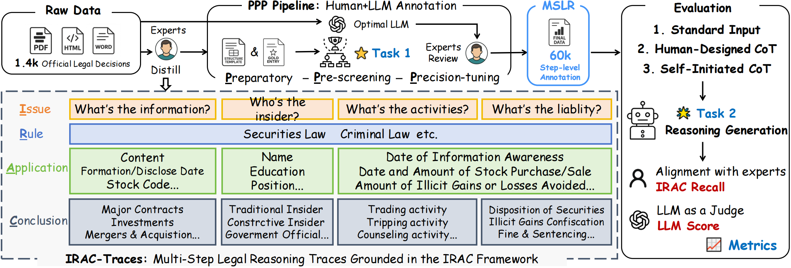

# MSLR: Multi-Step-Reasoning-Trace 中文多步法律推理基准测试集
 [](https://arxiv.org/abs/2511.07979)  [![Hugging Face](https://img.shields.io/badge/View%20on%20Hugging%20Face-blue?labelColor=gray&logo=data:image/png;base64,iVBORw0KGgoAAAANSUhEUgAAACAAAAAgCAYAAABzenr0AAAAIGNIUk0AAHomAACAhAAA+gAAAIDoAAB1MAAA6mAAADqYAAAXcJy6UTwAAAAGYktHRAD/AP8A/6C9p5MAAAAJcEhZcwAALEsAACxLAaU9lqkAAAAHdElNRQfoBRILLggNuk3UAAAKNklEQVRYw42WeXCU9RnHP7/32CO7m2M3gYVwQwMptAqWVDwwrSLToaVVi7UFWg+mM5UZtdoZay1Oq70tM+rYc3RqhxioFlBRZERGSZSjtiEakgqSAwo5dpNNdrPnu+/7/vrHbxNQccbfzM6+8zue4/s8z/d5BJ+wHn/8cRKJBLNmzeKOO+7gxIkT1NXVTZ4fPHzMF41O87iOI3u6TxbWrP6SNXHW2NjI+Pg4d999N/F4nDVr1lBfX8+nXk8//TRSSlavXo2UEiklmBUiMW7PKzhyve24jzlW+iUnP/qmkx97wynmdxZd+ZucLb8xNJyaNvFGSsn9998PwIEDBy6qS3x0Y/v27SxdupSFCxdO7o1l7IVBn36Hnum+UcSOzCH+L53xHiimQOjgq4GqxTDlSktGlr1ve8LNiZHRbVNrqvoBhBBIKdm/fz/XX3/9J3u+c+dOOjo6Jq1v/sdOM1+UG9xU7/uy7edS/nORlE0eKZ83pNzjl/LVoJR7A1K+4JVyuy5lU1DKvddK2fOcdKzM4UzeWQUIKeWkjj179lwcgVOnThGJRKisrATgzbeO+q68fPl95tCBB2h7KEDqHagJQFUAvAYIcf61BBwXshbEUzCuwdwNyEt+OmR5Z96/YvmSbW3tx91FixYhpeTIkSOEw2EA9AkDYrEYe/bsYd26dTzyq98b3/nWN39ont31Mw7f6Ufrhrk1EC4DU79Y5EAT4DOgMgA+4MwhxHBXUI+uWHnrDx48bejieDKZpKGhgcHBQXbt2nUegebmZpLJJOvXrycUCpErcqM/9vrfeOv2coIJmBEGXShPP80SQLYIPTGo/hryyr/0pZzymyuCvncAWltbiUaj1NXVKQMGBgaYM2cO+XyegZHszKg59IJo2bAMu015rolPqfkjRmQsODUM9T/BuWTLC8faj3/3C5ddOr5p0yZCoRCPPfYYemdnJ/v27WP37t0IIfCa2p3GiSc30r8d5laDRz8vUCv9XwyJibMLzz26CvKZdrToyjmVsy97z9RF19q1a4nFYpimidbZ2UlLSwuaptE3mJlmpE/eQk+zSjifoYQJiCV0/v5KOfsOBSjaH0ek4wMvf9ldyXsnvec3JRAOgpGAU9t8Xs3e8Mqrr5UBdHZ2cu+996IFg0F27NgBQE048EVt6GA9Vi9UBZUAKUHCs6+Vs3V7mIefiXDspFd5XEJmLK3x22fDPP5cJb9rDjM6rivtEtA1qA5C/z60TN+KL664ug7g5ZdfJhqNovX29iKlRAiBR2avYPAtDwFNwVd0YHAUkhnSOY2qkEPdTAvb+TACtiOoqXSYX1skmxfYtoSRFMTHwHUh5IdiPyLRXhMI+C8D6Orq4u2338Z49913AWh68ZBfs0Y+S+p9CPpUnTsOZAugC265LsXVl+RYviiPx5Tgnoc5Uu7wy+/HOT1kEh/TqS63od9Syl0XTANMBxIdwpi1bokQQkgp5RNPPIE2NDQEQP2iujJhjUYpDIPXVJK9JkyPQLicz8ws0nhZlkDAxTQ+nIVCQJlfUj+vwMqlOYSuwZRKiIZB11VienXInEHIYu0PNt9lCiHo6+tDy2azAJT5fR7h5Py4BRW3Ccl+DxiqElLjGr1nTVx5QdZr6jea0uk760E6Jau8ZsmR0j1dg+I4QtrBJUs+pwPE43EMTVPKXNeVEk0KIUC6H683Af897eGRZyJc/fkcqxoyzKixyRY02k542X0wxKxokUc2DSM+ViSlDaEhEe6E047jYPh8PgBi8eH8ovmBFHoZWKOQLyqrDW3yfU2lQ74gaN5fzkuHAlSFXPKWYDSlYxUFy+vzaMYFdkvAclQlFR2oCCOFkdje3GTfcMMNhMNhjJ6eHoQQ/GjL1vxVP/5eXCubAed6wRWK96dXgO1CwWZWZYAVn8uzrzVIY05jNKsRAXqB/kqHxmVZSBdgJAchb6mKUqVmZcP8hbgY8bb/vOOMjY4gpcRoaWmhqqpKPPzA5m/q2f+uwHUg50JtBRRs6BlRVKwJjJzFbV/xUhczWHfCS8YVBITkXNDl5NeSLKnNwKmEUjicVihMCULBgREHcoN48mdvSmfzBwN+70tQ6tVDY9bsKbJ7n2jdsIhku/K4thJqgnAyBn5TfXcPw9wwuCFo80O/CX4XFudhYQGGkjCShXkR6B1R72aFoW8ERnMqnDNuxL3ir++ciRe+OmfG1JgB4PV6Zot490zGu2BeNeRtiKeVgOkVkMiq76AXhtKwwAerbMUFE/yfs2E4A5GAyh1Th2g5xMclliNYUA1FG+KHEfnYvEBg5nQgpikYnABC6DiaUlzug9lVCkah4CeehqkhNXTE0hKnlGQuUJTQn1L3qsqgPykJeiFTkGSLgrkRMDRJPC3BAKQBbtlED8Nv0sDAGz48BfCZcHZMoRAth1xRxdFrKASi5TCQEiTzcnIuiaUhmVNh8+gQ8goqfFB0BdFyGM1KBscFFWWCYj8i/q+KUDCwDJQ5SISB7gNXKu/DZTCSUTQ6Jag8C3iUx1OCqs/HxqHcC0VXITU1BBWqpKkOqLteAwZSEkMXzKyETKHUoHxIiXneAElmkjPSBWVI0KviPjGMTNS2pkGlH/qTAqdU366ECv957pq8KyASEGpWLIWzREyulFkQE01V2Hgj6mGZqRQ4bmn+u8gq2OcNm5Bp2XxsVtSEynyJSk5TgDDBUwFSFidzIDGaeEPOveUMs26FvjQMJJQs21UsdqGi8byafHMWfDAIfXFl0GBSseeFdx2pHJEOnI7DkAZLHsCdcsX7g/3/OwQgNm7cKLZt26YPJ1JrqwL8Qhs4UE93E8TeBmcYvEIlliYU3BkXpq6GaCNYKdAMMAPQswPG2yBoqjJ0XEVARQ08tTB9FSzYiBNpODacSD0QnVrz+j333OOKzs5Obr/9dnH06FGt/b3OBQs+U/dtn2Z9Q09/sJDh//hIvAeZ/4GTB281TFuJnLm2P69X75DSzSJxhaZV+XLd3xZndlcz/G8opsEMQmgeRJYiI8tybtns4zlL7jre8e5zKy5vOL127Vq3qalJ8uijj9La2sr69esnKMXY//obM4aGk1/P5J1fW0X7RdvKHbELmbaiVTiYKzhP9J05dxXgQY2c+ozaWt+5weHr8pbz56KVb7ULmWO2lT9cKDq70jn7kf6hkTUvvrRnWinptU2bNokjR46wdetWjK6uLkzTpKmpSS5fvpz9+/c7q677Uj9wDnjl1ttu8zY2ftkfDIb0s2fPWPfcfVcasC+99FJRX18vpZS0t7dbtdHqA0JoLX/445+CU6ZO9STHRu19r76ae/755/IluhI333yzvOaaa+TmzZtpaGggFoshEokETz31FLNnz6a1tZUnn3ySo0ePsnfvXtHR0cGxY8dEb2/vZGJfe+21cuXKlfKhhx6ivr4ey7Lo7u5my5YtoqWlhZaWlslSmD9/PsuWLZOLFy+WDz74IKZpct9993HTTTdx7tw5PB4P/wdyObJGug0H9QAAACV0RVh0ZGF0ZTpjcmVhdGUAMjAyNC0wNS0xOFQxMTozMzozNCswMDowMNKO6kUAAAAldEVYdGRhdGU6bW9kaWZ5ADIwMjQtMDUtMThUMTE6MzI6MTArMDA6MDD6exqpAAAAKHRFWHRkYXRlOnRpbWVzdGFtcAAyMDI0LTA1LTE4VDExOjQ2OjA4KzAwOjAwcvvAdgAAAABJRU5ErkJggg==)](https://huggingface.co/datasets/Yuwh07/MSLR-Bench)   [![ModelScope](https://img.shields.io/badge/ModelScope-black?logo=data:image/svg+xml;base64,PHN2ZyB3aWR0aD0iMjIzIiBoZWlnaHQ9IjIwMCIgeG1sbnM9Imh0dHA6Ly93d3cudzMub3JnLzIwMDAvc3ZnIj4KCiA8Zz4KICA8dGl0bGU+TGF5ZXIgMTwvdGl0bGU+CiAgPHBhdGggaWQ9InN2Z18xNCIgZmlsbD0iIzYyNGFmZiIgZD0ibTAsODkuODRsMjUuNjUsMGwwLDI1LjY0OTk5bC0yNS42NSwwbDAsLTI1LjY0OTk5eiIvPgogIDxwYXRoIGlkPSJzdmdfMTUiIGZpbGw9IiM2MjRhZmYiIGQ9Im05OS4xNCwxMTUuNDlsMjUuNjUsMGwwLDI1LjY1bC0yNS42NSwwbDAsLTI1LjY1eiIvPgogIDxwYXRoIGlkPSJzdmdfMTYiIGZpbGw9IiM2MjRhZmYiIGQ9Im0xNzYuMDksMTQxLjE0bC0yNS42NDk5OSwwbDAsMjIuMTlsNDcuODQsMGwwLC00Ny44NGwtMjIuMTksMGwwLDI1LjY1eiIvPgogIDxwYXRoIGlkPSJzdmdfMTciIGZpbGw9IiMzNmNmZDEiIGQ9Im0xMjQuNzksODkuODRsMjUuNjUsMGwwLDI1LjY0OTk5bC0yNS42NSwwbDAsLTI1LjY0OTk5eiIvPgogIDxwYXRoIGlkPSJzdmdfMTgiIGZpbGw9IiMzNmNmZDEiIGQ9Im0wLDY0LjE5bDI1LjY1LDBsMCwyNS42NWwtMjUuNjUsMGwwLC0yNS42NXoiLz4KICA8cGF0aCBpZD0ic3ZnXzE5IiBmaWxsPSIjNjI0YWZmIiBkPSJtMTk4LjI4LDg5Ljg0bDI1LjY0OTk5LDBsMCwyNS42NDk5OWwtMjUuNjQ5OTksMGwwLC0yNS42NDk5OXoiLz4KICA8cGF0aCBpZD0ic3ZnXzIwIiBmaWxsPSIjMzZjZmQxIiBkPSJtMTk4LjI4LDY0LjE5bDI1LjY0OTk5LDBsMCwyNS42NWwtMjUuNjQ5OTksMGwwLC0yNS42NXoiLz4KICA8cGF0aCBpZD0ic3ZnXzIxIiBmaWxsPSIjNjI0YWZmIiBkPSJtMTUwLjQ0LDQybDAsMjIuMTlsMjUuNjQ5OTksMGwwLDI1LjY1bDIyLjE5LDBsMCwtNDcuODRsLTQ3Ljg0LDB6Ii8+CiAgPHBhdGggaWQ9InN2Z18yMiIgZmlsbD0iIzM2Y2ZkMSIgZD0ibTczLjQ5LDg5Ljg0bDI1LjY1LDBsMCwyNS42NDk5OWwtMjUuNjUsMGwwLC0yNS42NDk5OXoiLz4KICA8cGF0aCBpZD0ic3ZnXzIzIiBmaWxsPSIjNjI0YWZmIiBkPSJtNDcuODQsNjQuMTlsMjUuNjUsMGwwLC0yMi4xOWwtNDcuODQsMGwwLDQ3Ljg0bDIyLjE5LDBsMCwtMjUuNjV6Ii8+CiAgPHBhdGggaWQ9InN2Z18yNCIgZmlsbD0iIzYyNGFmZiIgZD0ibTQ3Ljg0LDExNS40OWwtMjIuMTksMGwwLDQ3Ljg0bDQ3Ljg0LDBsMCwtMjIuMTlsLTI1LjY1LDBsMCwtMjUuNjV6Ii8+CiA8L2c+Cjwvc3ZnPg==&labelColor=white)](https://modelscope.cn/datasets/yuwenhan/MSLR-Bench)

随着大语言模型（LLMs）在法律应用中的快速发展，系统评估其在**判决预测中的推理能力**变得尤为迫切。目前公开的法律测评基准缺少统一的评估架构，对这两个任务的支持并不好。为填补这一空白，我们提出了 **MSLR**，填补了中文法律自然语言处理领域中结构化推理评估的关键空白，并为法律垂类大模型系统的评估与优化提供了坚实基础。更多详情可查看我们的论文。


## 📄 介绍
MSLR 经精心设计，可以对大模型的**法律文档理解和案情分析推理能力**进行精确评估。我们设计了一套半自动化的数据集构建方案，通过**人工+LLM**的方式，构建了一个全面的内幕交易数据集，同时也可以很轻易地扩展数据集的数量与案情的种类。再次基础上，我们设计了**结构化信息抽取** 和 **案件事实分析与判决预测** 两个任务。为了更好地评估模型在这两个任务上的性能，我们设计了详细的不同评估方式，评估结果**精确全面**。同时，我们通过人工专家设计了一条**基于人类经验的CoT思维链**，希望测试模型在得到推理链的情况下推理能力是否能有所提升，与人类司法过程是否有更强的一致性。

## 📖 数据来源与构建流程

### 数据来源
MSLR 的数据主要来自以下三个公开渠道，聚焦于2005年至2024年间的**内幕交易案例**，覆盖行政案件、刑事案件及不起诉案件等法律阶段：

- 中国证券监督管理委员会（CSRC）发布的行政处罚决定书；
- 中国裁判文书网公布的刑事判决书；
- 全国检察机关公开的不起诉决定书。

每份原始法律文书以 `.docx`、`.pdf` 或 `.html` 格式采集，并转换为结构化文本进行统一处理，同时记录关键信息如**文书编号、裁决日期与来源链接**。我们删去了一些没有给出具体案件描述与结果的公开文书，保留了有效的部分。

### 结构化数据设计
我们与法律专家合作，制定了统一的结构化字段体系，详见`data/schema.json`，涵盖内幕信息识别、当事人基本信息、交易行为、非法所得计算、适用法条及最终处罚结果等六大维度。所有字段严格对齐《中华人民共和国证券法》《中华人民共和国刑法》《民法典》等相关条款，确保数据的**法律一致性、语义可比性**与司法推理的结构化支持能力。

### 数据标注过程
#### 人工标注
在第一阶段，我们对超过 **1000份真实案例文书**进行了逐项人工标注，依据结构模板标注超过 **50,000 个字段**。所有标注由具备法律背景的专业人员完成，并设置了**交叉复核与抽样质检机制**，以确保一致性与法律解释的准确性。
#### LLM辅助抽取 + 人工核验
在初步建立高质量种子集后，我们扩展性地处理了 **400 余份新增案例文书（2020–2024年）**。在实验对比不同大模型抽取策略后，最终选用性能与性价比兼优的 DeepSeek-V3 作为自动抽取工具。为提升其在法律任务下的适应能力，我们对抽取 prompt 模板进行了专门优化。所有自动输出均由法律专家逐字段进行**人工复核**，确保结构完整与语义准确。



### 数据统计概览

| 指标 | 数值 |
|------|------|
| 时间跨度 | 2005–2024 |
| 案例总数 | 1389 |
| 每份文书平均字段数 | 43.03 |
| 总结构化字段条目 | 59,771 |
| 核心字段平均填写率 | 86.58% |
| 每份文书平均字数 | 2515.99 |

### 数据格式
所有的原始和结构化数据都储存在 `data` 文件夹下，处理后的数据都以json文件格式存储，具体见 `data/processed` ，可以通过 `json.load` 的方式加载使用。其中`input.json` 文件是汇总了每个json文件中作为输入的部分，方便使用者调用。

## 🧩 Benchmark任务定义

### Task 1：大模型自动标注（LLM Automatic Annotation）

该任务旨在从法律案情段落中提取标准化的关键字段，模拟法律专业人士阅读文书后的要素归纳过程。字段涵盖内幕信息的认定、当事人信息、交易行为、违法所得、适用法律条款与处罚结果等，具体字段定义见 `data/extract_schema.json`。

- 输入：原始法律文书中的案情描述段（自然语言文本）
- 输出：结构化 JSON 格式，填充各类字段信息
- 评估指标：
  - Field Accuracy：字段值的严格匹配准确率
  - Semantic Accuracy：字段语义相似度判断的匹配率
  - Overall Accuracy：上述两项的加权综合评分
  - Field Completeness Rate (FCR)：输出结构的字段覆盖与格式完整性


### Task 2: 基于 IRAC 框架的中文多步法律推理 (Chinese Multi-step Legal Reasoning under the IRAC Framework)
此任务关注模型能否基于案情描述生成逻辑严密、结构完整的法律分析过程与最终判决，评估其推理质量与法律要素的覆盖情况。

- 输入模式：
  - 标准输入（Std）：仅提供案件描述，让模型自主完成分析与判断
  - 链式输入（CoT）：提供案件描述 + 结构化推理提示，引导模型按“事实识别 → 法律适用 → 裁判结果”的顺序推理
- 输出形式：自然语言撰写的完整分析过程，涵盖核心事实、法律条款适用与裁判结论
- 评估指标：
  - LLM Score：由高性能大语言模型依据逻辑性、完整性和合法性对输出评分（等级制：A/B/C）
  - IRAC Recall：衡量模型输出与人工标注结构字段的一致性程度（字段级匹配）


#### CoT 推理模板构建
专业法律从业者为模型设计了一套基于人类经验的 Chain-of-Thought（CoT）提示词模板，专门用于引导模型在内幕交易案件中进行类比于司法实践的逐步推理。
在设计过程中，充分参考了《中华人民共和国刑法》《中华人民共和国民法典》《证券法》等相关法律条文，确保推理链在法律适用与表述上的**严谨性与权威性**。同时，我们邀请具有多年审判实务经验的法律从业者参与模板构建，依据**真实裁判逻辑**抽象出司法机关在处理内幕交易案件时普遍遵循的推理路径。
```text
内幕信息形成 → 信息知悉 → 交易行为 → 非法所得 → 法律适用 → 处罚决定
```

## 📊 实验设计
在实验中，我们评估了三大类模型在两个任务上的性能表现.
此外，我们在 `example/` 目录中提供了一个示例下不同模型输出结果，直观展示不同模型在实际法律文本处理中的差异与能力边界。

### 实验模型
- **通用大模型（General-purpose LLMs）**：如 GPT-4、Qwen2.5、GLM4、DeepSeek-V3 等，具备全面的文本理解与生成能力;
- **法律领域模型（Legal-domain LLMs）**：如 CleverLaw、Lawyer-LLM 等，针对法律语料微调，具有更强的专业性;
- **推理增强模型（Reasoning-augmented LLMs）**：如 DeepSeek-R1、QwQ-32B 等，通过引入快慢思维机制，拥有更强的推理能力。


## 🔧 如何评估模型
本项目提供了一个高质量、结构化的中文法律判决基准，覆盖“结构化信息抽取”与“法律事实分析与判决预测”双任务，并测试了 Chain-of-Thought 提示对模型推理效果的影响。

### 环境准备
1. **Python版本：** 建议使用Python ≥ 3.10
2. **安装依赖**
```bash
pip install -r requirements.txt
```
3. **准备模型文件：**
    - 将待评估的大语言模型文件或配置于 `model/` 目录
    - 下载中文法律语义嵌入模型 `ChatLaw-Text2Vec`，并放置于 `embedding_model/` 路径下，用于语义相似度计算


## 执行任务流程
### 运行基于 IRAC 框架的中文多步法律推理
```bash
python script/predict.py \
  --model_path /path/to/model \
  --data_path ./data/input_data.json \
  --output_dir ./output
```
> 在运行的过程中会将Std输出和CoT输出一起保存到输出的json文件中，如果要修改CoT，请直接修改python文件中的prompt

### 模型评估脚本
#### 评估Task 1 大模型自动标注
**1. Overall Score（字段准确率 + 语义相似度）** 
```bash
python script/evaluate_Overall_task1.py \
  --gold_file data/processed \
  --pred_file output/task1 \
  --embedding_model embedding_model/ChatLaw-Text2Vec \
  --semantic_threshold 0.6
```

**2. FRC Score（字段完整率）**
```bash
python script/evaluate_FRC_task1.py \
  --data_dir ./output/task1 \
  --gold_dir ./data/processed
```
#### 评估Task2基于 IRAC 框架的中文多步法律推理
**1. LLM Score（推理质量等级A/B/C，由模型审阅）**
```bash
python script/evaluate_LLMScore_task2.py \
  --gold_dir data/processed \
  --pred_dir output/task2 \
  --eval_scores_path result/llm_score_eval.json
```

**2.Relative Score（推理输出与结构字段的一致性）**
```bash
python script/evaluate_RelScore_task2.py \
  --gold_dir data/processed \
  --pred_dir output/task2 \
  --embedding_model embedding_model/ChatLaw-Text2Vec \
  --threshold 0.6 \
  --output_path result/relscore_task2.json
```


## 📎 引用方式

如果您使用了 MSLR 数据或代码，请引用我们的论文：
> @misc{yu2025benchmarkingmultisteplegalreasoning,
      title={Benchmarking Multi-Step Legal Reasoning and Analyzing Chain-of-Thought Effects in Large Language Models}, 
      author={Wenhan Yu and Xinbo Lin and Lanxin Ni and Jinhua Cheng and Lei Sha},
      year={2025},
      eprint={2511.07979},
      archivePrefix={arXiv},
      primaryClass={cs.AI},
      url={https://arxiv.org/abs/2511.07979}, 
}

## 🛡️ 声明

MSLR 所有法律数据均采自公开渠道，严格匿名化处理，仅用于研究用途，严禁用于真实法律判断。